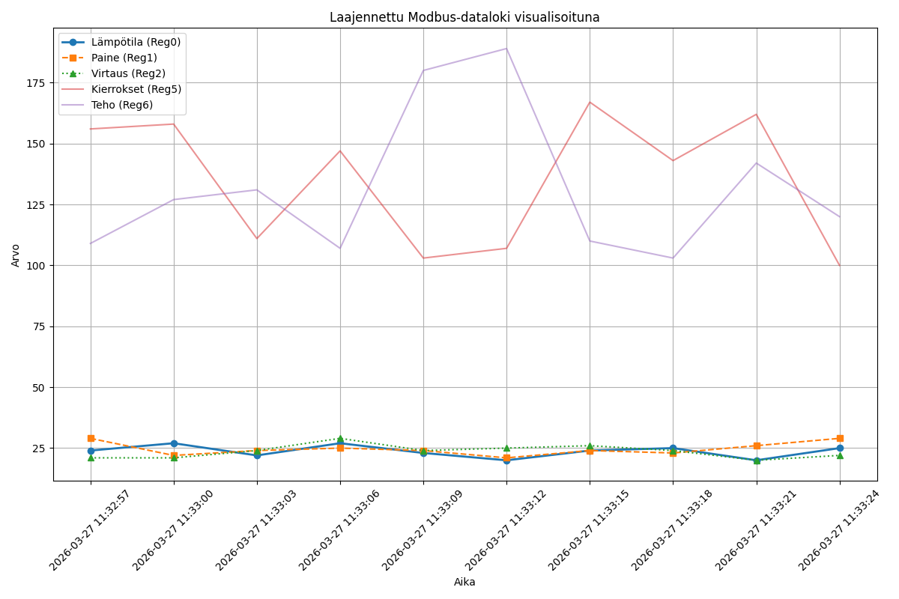

# modbus-logger-python
This project is a Python-based tool developed to collect, analyze, and visualize industrial data via the **Modbus TCP** protocol. It simulates a professional industrial monitoring solution where data flows from field devices (PLCs/Sensors) to a SQL database for real-time analysis.

## Key Features
* **Real-time Logging:** Dynamically reads 8 distinct Modbus registers (e.g., temperature, pressure, flow rate) at configurable intervals.
* **Fault Tolerance:** Features an automatic **Simulation Mode**; if the connection to the Modbus server is lost, the script continues to generate data to ensure continuity for testing and analysis.
* **SQL Integration:** Utilizes `pyodbc` to store collected data into a structured SQL database, enabling persistent historical tracking.
* **Data Visualization:** Includes a dedicated visualization module using `Pandas` and `Matplotlib` to analyze trends and system performance.

## Technical Stack
* **Language:** Python 3.x
* **Libraries:** `pymodbus` (communication), `pandas` (data science), `matplotlib` (graphing), `pyodbc` (database).
* **Protocol:** Modbus TCP/IP.
* **Environment:** Secure configuration using `.env` files for sensitive server and database credentials.

## Installation
1. `pip install pymodbus pandas matplotlib`
2. `python logger.py`
3. `python visualize_data.py`